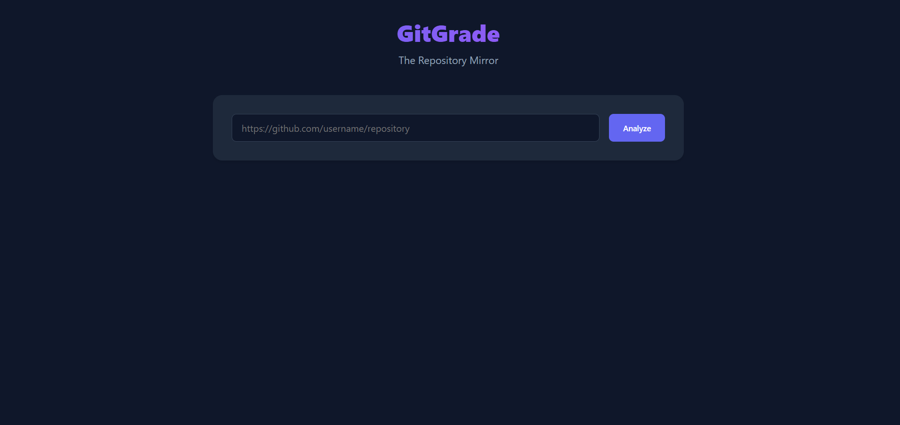

# 🚀 GitGrade: The Repository Mirror

[](https://gitgrade-hackathon-2025.vercel.app)
[](https://opensource.org/licenses/MIT)

**GitGrade** is an intelligent repository analysis tool designed to evaluate the **"Engineering Maturity"** of GitHub projects. It goes beyond simple code volume metrics, using an **SDET-focused scoring engine** and **Google's Gemini AI** to provide actionable feedback, a detailed score breakdown, and a personalized roadmap for improvement.

### 📺 [Click Here to Watch the Project Demo Video](assests/Video/gitgrade-hackathon-video.mp4)



> *Note: If the image above doesn't load, please ensure `gitgradeDashboard.png` is inside the `assests/screenshots/` folder.*

## 🌟 Why GitGrade? (The Case Study)

We built GitGrade to solve a specific problem: **Student code often works, but lacks engineering rigor.**

To prove it, we "dog-fooded" the tool on this very repository:
1.  **Initial Scan:** Scored **10/100 (Bronze)**. The tool flagged a lack of testing, no CI/CD, and missing license.
2.  **The Fix:** We followed GitGrade's own AI Roadmap—adding a `tests/` suite, GitHub Actions workflow, and proper metadata.
3.  **Final Scan:** Scored **80/100 (Silver)**. 

GitGrade doesn't just grade you; it teaches you how to be a better engineer.

## ✨ Key Features

* **🏆 SDET-Focused Scoring:** Evaluates projects on 5 critical dimensions:
    * **🧪 Testing & Quality**: Checks for `tests/`, CI/CD workflows, and linter configurations.
    * **🏗️ Architecture**: Rewards standard folder structures (`src/`, `app/`) vs flat layouts.
    * **🧹 Git Hygiene**: Analyzes commit history active volume and `.gitignore` usage.
    * **📄 Documentation**: Verifies README quality.
    * **🏷️ Metadata**: Checks for proper descriptions and licenses.
* **🤖 AI-Powered Mentorship**: Integrated with **Google Gemini 1.5 Flash** to generate a "Coding Mentor" summary and a specific, actionable roadmap.
* **📊 Detailed Breakdown**: A visual grid showing exactly where points were gained or lost.
* **🏅 Level & Medals**: Gamified grading system (Beginner to Advanced, Bronze to Gold).
* **🌑 Modern Dark UI**: Sleek, responsive interface built with vanilla CSS and JavaScript.

## 🛠️ Technology Stack

* **Backend**: Python, Flask, GitHub API
* **AI**: Google Generative AI (Gemini 1.5 Flash)
* **Frontend**: HTML5, CSS3 (Variables, Flexbox/Grid), Vanilla JavaScript
* **Deployment**: Vercel (Serverless Python)

## 🚀 Getting Started Locally

Follow these instructions to set up the project locally.

### Prerequisites

* Python 3.8+
* A Google Cloud API Key (for Gemini)

### Installation

1.  **Clone the repository:**
    ```bash
    git clone [https://github.com/Palguni28/gitgrade-hackathon-2025.git](https://github.com/Palguni28/gitgrade-hackathon-2025.git)
    cd gitgrade-hackathon-2025
    ```

2.  **Create and activate a virtual environment:**
    ```bash
    # Windows
    python -m venv venv
    .\venv\Scripts\activate

    # macOS/Linux
    python3 -m venv venv
    source venv/bin/activate
    ```

3.  **Install dependencies:**
    ```bash
    pip install -r requirements.txt
    ```

4.  **Set up Environment Variables:**
    * Create a `.env` file in the root directory.
    * Add your Gemini API Key:
    ```env
    GEMINI_API_KEY=your_actual_api_key_here
    ```

5.  **Run the Application:**
    ```bash
    python app.py
    ```

6.  **Access the Dashboard:**
    * Open your browser and navigate to `http://127.0.0.1:5000`.

## 💡 How it Works

1.  **Input**: Enter a public GitHub repository URL (e.g., `https://github.com/pallets/flask`).
2.  **Analyze**: The app fetches metadata via the GitHub API.
3.  **Score**: The Heuristic Engine calculates a score (0-100) based on SDET principles.
4.  **Consult**: The Gemini AI analyzes the metrics to provide qualitative feedback.
5.  **Result**: You get a Score, Medal, Breakdown, and Roadmap.

## 🤝 Contributing

Contributions are welcome! Please feel free to submit a Pull Request.

## 📄 License

This project is open-source and available under the [MIT License](LICENSE).